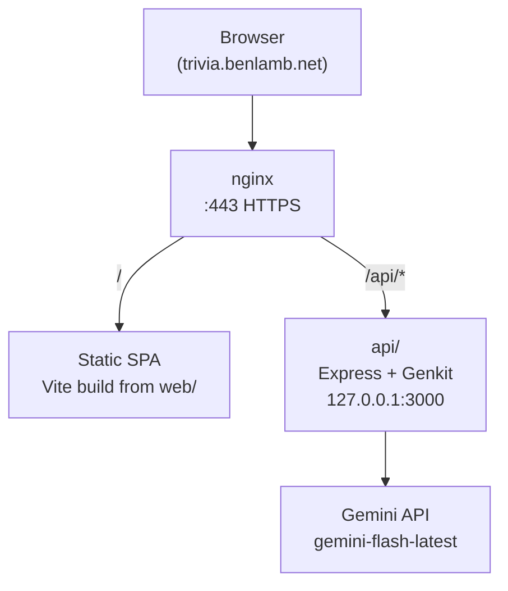
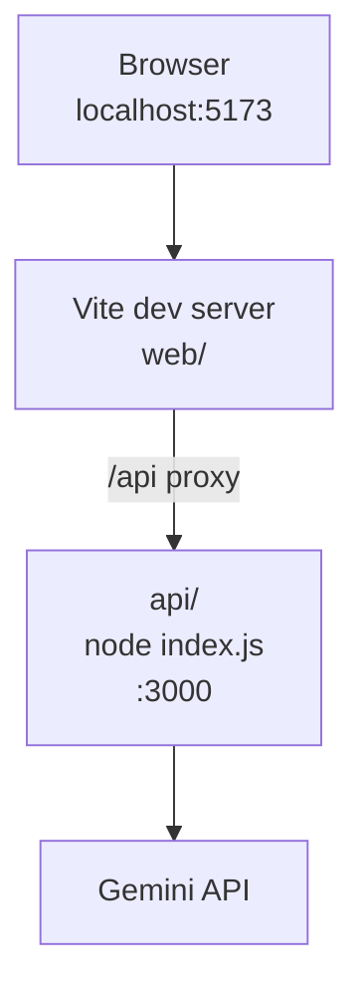
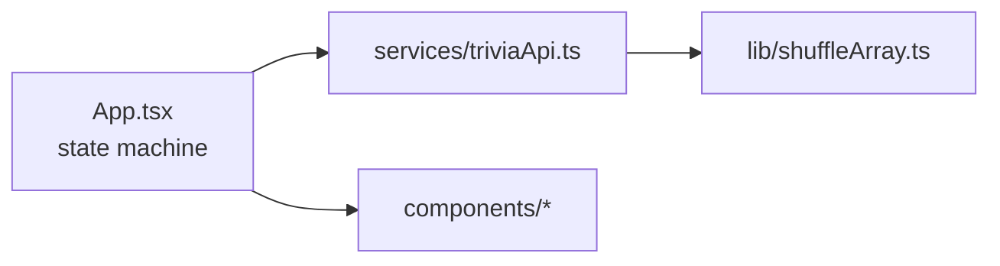
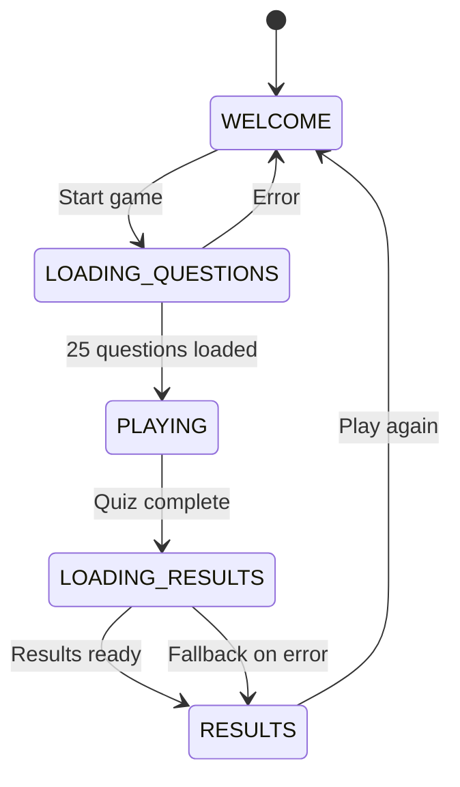
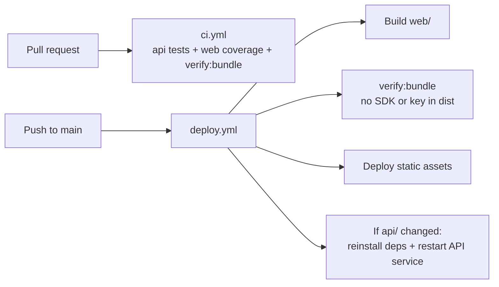

# Architecture

How the IT Trivia Challenge monorepo is wired: a React SPA, a small Genkit API proxy, and Gemini for on-the-fly questions and results. No database, no auth, no API keys in the client.

**Live:** [trivia.benlamb.net](https://trivia.benlamb.net)

## Monorepo layout

| Path | Stack | Role |
|------|-------|------|
| `web/` | React 19, Vite 8, TypeScript | SPA; calls `/api/*` only |
| `api/` | Express, Genkit, zod | Gemini proxy; secrets in `api/.env` (gitignored) |
| `.github/workflows/` | GitHub Actions | `ci.yml` on PRs; `deploy.yml` on push to `main` |

Backend source lives in **`api/`** inside the repo. In production, a systemd unit named `trivia-api` runs `api/index.js` from the deployed clone — that name is the **service**, not a separate top-level app directory.

## Production request flow

- **nginx** serves the built frontend at `/` and proxies `/api/*` to the Node process on loopback.
- Static files are deployed artifacts (built from `web/dist/`), not edited on the server by hand.
- **`GOOGLE_GENAI_API_KEY`** exists only in `api/.env` on the host running `api/`.

## Local development

Run the API and frontend in two terminals (`api/` then `web/`). Vite proxies `/api` to port 3000 — see `web/vite.config.ts`.

## Frontend (`web/`)

| File | Responsibility |
|------|----------------|
| `App.tsx` | Game state machine; orchestrates screens |
| `services/triviaApi.ts` | `POST /api/questions`, `POST /api/results` |
| `lib/shuffleArray.ts` | Shuffles options; assigns question `id` |
| `components/*` | Welcome, Quiz, Results, Loading, Error, Footer |
| `types.ts` | `GameState`, `Question`, `GameResult`, categories |
| `index.tsx` | React root mount |

### Game state machine

**Start game:** Welcome optionally adjusts starting difficulty → `POST /api/questions` (plus previous quiz questions on replay) → add `id`, shuffle options → quiz (25 questions, 5 categories × 5 each).

**Finish game:** Tally score → `POST /api/results` with `{ score, total }` → personalized title, evaluation, motivation.

## API contract

Keep **`api/index.js`** and **`web/services/triviaApi.ts`** in sync when changing shapes.

| Method | Path | Request | Response |
|--------|------|---------|----------|
| `GET` | `/api/health` | — | `{ "status": "ok" }` |
| `POST` | `/api/questions` | `{ difficulty?, previousQuestions? }` | `{ questions: [{ category, text, options[4], correctAnswer }] × 25 }` |
| `POST` | `/api/results` | `{ score, total }` | `{ title, evaluation, motivation }` |

The frontend sends full previous quiz questions on replay to help Gemini avoid exact or near-duplicate questions. It adds `id` and shuffles `options` after fetch; the API returns canonical `correctAnswer` text.

## Backend (`api/`)

Single entry point: **`api/index.js`** — Express routes plus two Genkit flows with zod structured output.

| Flow | Input | Output |
|------|-------|--------|
| `triviaQuestionsFlow` | `{ difficulty?, previousQuestions? }` | 25 MCQs across 5 IT categories (5 per category) |
| `triviaResultsFlow` | `{ score, total }` | Fun title, evaluation, motivation |

| Concern | Detail |
|---------|--------|
| Model | `googleai/gemini-flash-latest` (`MODEL` in `api/index.js`) |
| Rate limit | 10 requests/minute on `/api/questions` and `/api/results` |
| CORS (prod) | Origin restricted to `https://trivia.benlamb.net` |
| Secrets | `GOOGLE_GENAI_API_KEY` in `api/.env` only — use `api/.env.example` as template |

## CI and deploy

- **`ci.yml`:** Node tests in `api/`, Vitest coverage in `web/`, then `npm run verify:bundle` (ensures no `@google/genai` or `AIza…` in client bundles).
- **`deploy.yml`:** SSH to VPS, `git pull`, build frontend, rotate nginx static root, restart the API systemd unit when `api/` changed.

Operator detail (paths, rollback, journalctl): [CLAUDE.md](../CLAUDE.md).

## Security checklist (safe to share publicly)

- No API keys, tokens, or `.env` contents in the repo or client bundle.
- Client only talks to same-origin `/api/*` (or Vite proxy in dev).
- Post-build check: `web/npm run verify:bundle` (also run on deploy).
- Rotate keys in `api/.env` on the server and restart the API service — never commit `.env`.

## Related docs

- [README.md](../README.md) — setup and quick architecture summary
- [CLAUDE.md](../CLAUDE.md) — deploy paths, systemd, manual ops
- [CONTRIBUTING.md](../CONTRIBUTING.md) — PR workflow
